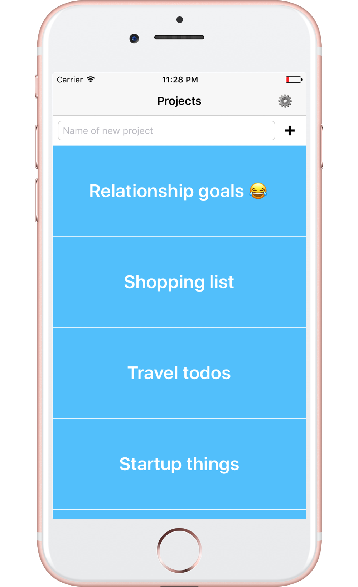

# Todome for iOS

Todome is a real time todo app based on Firebase developed by [Karol Karczewski](https://twitter.com/karolkarczew) and written in Swift 3.

Todome allows you to handle all your todos organized in projects.

## Getting Started

To get started and run the app, you need to follow these simple steps:

1. Open the Todome workspace in Xcode.
2. Change the Bundle Identifier to match your domain.
3. Go to [Firebase](https://firebase.google.com) and create new project.
4. Select "Add Firebase to your iOS app" option and follow steps.
5. Go to [Firebase Console](https://console.firebase.google.com), select your project, choose "Authentication" from left menu, select "SIGN-IN METHOD" and enable "Email/Password" option.
7. Open the terminal, navigate to project folder and run "pod update". 
8. You're all set! Run Todome on your iPhone or the iOS Simulator.

## Compatibility

This project is written in Swift 3.0 and requires Xcode 8.2 to build and run.

## Author

* [Karol Karczewski](https://twitter.com/karolkarczew)

## License

Copyright 2017 Karol Karczewski.

Licensed under MIT License: https://opensource.org/licenses/MIT
